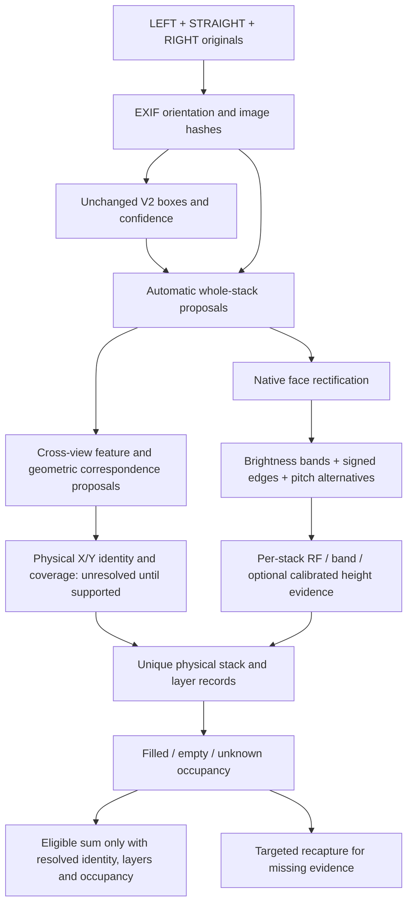

# Candidate 3D beam counting — 2026-09-16

## Scope and evidence status

This implements a **local research candidate**, not a production replacement.
The checked-out starting commit is `bd8abb4b6ecc8c0fcfaff5e9661b5688e212d558` on
`codex/hybrid-cell-counting`. The pasted prompt's rolled-back production state
is stale: the compatibility repair `ab67cd59-3f4e-4628-a0fa-d085f56a3fe8` is the
latest recorded deployment. It returns V2 boxes for optional-marker scans;
it does not execute Python band analysis or 3D reconstruction. No deployment,
APK rebuild or retraining belongs to this research checkpoint.

The phone's 96/89/98 result and a single 98-versus-100 comparison do not establish
98% real-world accuracy. MUTAA has no confirmed physical totals yet. Reference
truth is evaluation-only and is not accepted as an inference parameter.

## One pipeline, complementary views



Straight-view order proposes front X structure; oblique views reveal additional
Y positions. Camera pose and shared bases must establish which stacks overlap.
The user example `1 2 3 4 5` and `5 5A 5B 5C` shares physical stack 5, counted
once. Neither equal heights nor matching left-to-right indices prove identity.

## Implemented components

- `stack_measurement.localize_stacks`: existing tray-center/width clustering,
  sloped side-envelope polygons, detector support and clipping flags. It does
  not assume five stacks. It can miss whole stacks and merge depth faces when
  V2 is sparse. Top/base completeness remains unknown.
- `spatial_3d.beam_evidence`: wraps the existing paired brightness/signed-Sobel
  method, with pitch search scaled to native crop height. Preserves alternatives,
  band centers, coverage, endpoint status and diagnostic quality. No blind +1.
- `spatial_3d.fuse_stack`: independently reports RF, band and optional supplied
  calibrated-height results. A candidate Z is exploratory, never an accepted
  physical count. RF=19 and band/height=20 can retain candidate 20; there is no
  validated real-image acceptance policy yet. No weighted averaging.
- `spatial_3d.propose_correspondence`: SIFT ratio matches and planar RANSAC
  between proposed stack faces. Requires at least 12 inliers and 60% inlier
  fraction; these are experimental filtering parameters, not validated accuracy
  gates. Repeated texture can create false matches, and two different faces of
  the same corner may share no planar texture. Outputs stay provisional. No
  identity is accepted and no real scene grid is invented from these matches.
- `spatial_3d.assemble_grid`: accounting core for explicitly resolved coordinates
  and per-layer occupancy, with geometry provenance required. Duplicate physical
  positions count once; conflicting observations block totals; known absent
  cells differ from unobserved cells. Unequal heights work. Unknown occupancy
  prevents an eligible total. This is exercised with synthetic fixtures only;
  real-image correspondence is not yet connected to certified grid assembly.

Existing `calibrated_height_evidence` validates profile/version and camera/survey
provenance. Actual measurements, camera intrinsics/poses, tray profiles and
surveyed anchors have not been supplied. Metric reconstruction, automatic
fiducial reading, and per-layer occupancy classification remain unimplemented
in this candidate. Optional geometry support does not require manual cell IDs.

## Exact band-method history

`layer_signal.count_layers`, exercised by `scripts/evaluate_100_tray_layers.py`,
produced 40/10/10/11/11 on the manually cropped old scene at 512x768. Absolute
edge response admits half/double-pitch ambiguity. It is unchanged.

`stack_measurement.analyze_rims`, exercised by
`scripts/measure_stack_candidates.py`, produced 19/19/20/19/19 on manual faces
at both native and resized resolution. It pairs opposite signed edges around
one consistent brightness polarity and retains p/2, p and 2p alternatives.
Egg rows can create these bands; bands are not automatically tray rims. Cropped
endpoints are particularly problematic. Physical counts remain null.

The new MUTAA runner uses automatic detector-based faces, not the old manual
faces. Differences are not evidence of improved accuracy without matched labels.

## Local API

`POST /candidate/count-3d` accepts multipart `left`, `right`, `straight` and
JSON `evidence`:

```json
{
  "views": {
    "left": {"image_sha256": "...", "coordinate_frame": "exif_transposed_pixels", "detections": []},
    "right": {"image_sha256": "...", "coordinate_frame": "exif_transposed_pixels", "detections": []},
    "straight": {"image_sha256": "...", "coordinate_frame": "exif_transposed_pixels", "detections": []}
  },
  "sop": {"vertical_stacks": true, "orthogonal_layout": true, "all_positions_observed": true, "top_base_visible": true}
}
```

Each detection contains original, EXIF-oriented `bbox: [x1,y1,x2,y2]` and
`confidence` in [0,1]. Use real saved predictions, not expected counts. Inputs
are hash-bound but client-supplied, not authenticated model evidence. The route
returns `verified:false` regardless of client assertions. Known SOP violations
or failed image-quality checks yield `OUT_OF_OPERATING_ENVELOPE`; missing SOP
facts remain unknown. SOP declarations do not certify geometry.

Run locally bound to `127.0.0.1`; the route returns 404 for `APP_ENV=production`.
The route replays saved boxes and runs image analysis; it does not fetch V2
itself. `scripts/audit_mutaa_baseline.py` performs the separate unchanged V2
collection through the existing authenticated Worker. The complete gateway JSON
is saved, but the gateway does not expose the complete upstream Roboflow JSON
or model image-size metadata. This limitation is explicit in the report.

## Operating profile to pilot, not a validated guarantee

1. Keep stacks stable between captures. Use an orthogonal arrangement with
   visible stack boundaries; record interior gaps instead of assuming a solid
   rectangle. Never infer hidden filled stock from the footprint alone.
2. Capture a front view and overlapping left/right oblique views. Include the
   same corner stack in each adjacent pair and show the base, top and rear edge.
   Add an elevated/rear close-up wherever three views leave a hidden position.
3. Keep the phone upright, focus on trays, avoid motion blur, backlighting,
   glare and clipped highlights. Use diffuse lighting that shows tray rims and
   eggs on both sides. Do not declare a lux or camera-angle guarantee without
   measurement. Distance is chosen to resolve layers, not a fixed unsupported
   number of metres.
4. For crowded views, capture overlapping stack close-ups in addition to the
   wide layout view. Keep originals. Increasing megapixels alone does not ensure
   higher model input resolution. Validate upload payload bounds separately.
5. Separate tightly nested empty trays where possible. Egg-containing includes
   partially filled trays; shell-only trays and unseen contents need review.
6. If metric height is used, identify the tray type and measure loaded stacking
   pitch using several known-height stacks. Survey a vertical scale/pose; a
   painted floor homography alone does not measure vertical height.

## Next measurable gates

Review MUTAA overlays and label complete stack faces, visible rims, shared
corners and occupancy. Obtain physical per-stack counts and session grouping.
First fix/evaluate localization and original-coordinate mapping; compare a
separate full-resolution stack-crop inference ablation without tuning to totals.
Then validate geometry against annotated correspondences. If detector misses,
merged boxes or class ambiguity persist, train a separate challenger with
`stack_face`, physical tray and filled/empty supervision. Current `egg_tray`
labels do not by themselves establish that supervision.

Freeze scenes by arrangement/session for held-out tests. Measure stack/scene
exact match, count MAE, matched precision/recall, occupancy errors, false
acceptance and coverage together. The synthetic grid tests establish bookkeeping,
not camera-based counting accuracy or the recovery of hidden inventory.

## 2026-09-17 candidate revision

Current local revision: `candidate-20260917`, extending checkpoint d5ddcc8.
See `reports/candidate-20260917/README.md` for measured results and blockers.
The response now uses `geometry` and `cells`; statuses are lowercase
`recapture_required` / `out_of_operating_envelope`. The current response model
cannot emit verified=true or numeric inventory totals. The separate synthetic
accounting core produces numeric totals only for supplied resolved observations.
Request and response JSON schemas are archived with this report. The local route
is `/candidate/count-3d` with three multipart images and JSON `evidence`; it is
unavailable in production. Hash binding is not authentication of RF predictions.

SOP fields include vertical_stacks, orthogonal_layout, all_positions_observed,
top_base_visible, stable_arrangement, boundaries_identifiable and
front_side_separation. False declarations trigger an operating-envelope failure;
missing declarations remain unverified. Declared visibility can identify an
occluded proposed stack or a missing rear/shared corner. Declarations are not
measured geometry. No floor-cell IDs are mandatory.

Each proposed face is rectified for bounded regional diagnostics and divided
into top/middle/bottom thirds. The profile records tunable pilot thresholds;
low-light, weak sharpness, contrast and possible image-boundary crops produce
specific actions. MOTION_BLUR is a compatibility reason code whose cause says
motion is unconfirmed; weak texture and defocus can also lower sharpness.
Occlusion is not inferred from darkness. Complete top/base visibility cannot be
proved merely because a detection envelope stays inside the image.

Correspondence now requires mutual ratio matches, at least 12 RANSAC inliers,
60% inlier fraction, 20% convex-hull coverage on each proposed face, projected
face IoU >=0.4 and median reprojection error <=3 resized pixels. These are
uncalibrated proposal filters, not identity acceptance criteria. Different
faces of a shared corner still need pose/base evidence; no stack is certified.

Grid cells carry physical_stack_id, observed_in and source-observation provenance
for each Z occupancy. Explicit gaps differ from unobserved cells. Repeated
observations of the same X/Y cell do not add inventory; conflicting repeats
block totals. Fully hidden stock remains unresolved even under a uniform SOP.

Worker changes are local: native encoding, sequential hashing and stage logs.
Python bands remain outside the Worker. Live WebSockets and warm inference may
improve feedback latency later; neither establishes geometry or occupancy.
