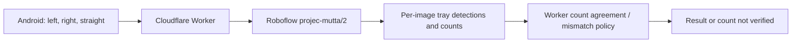
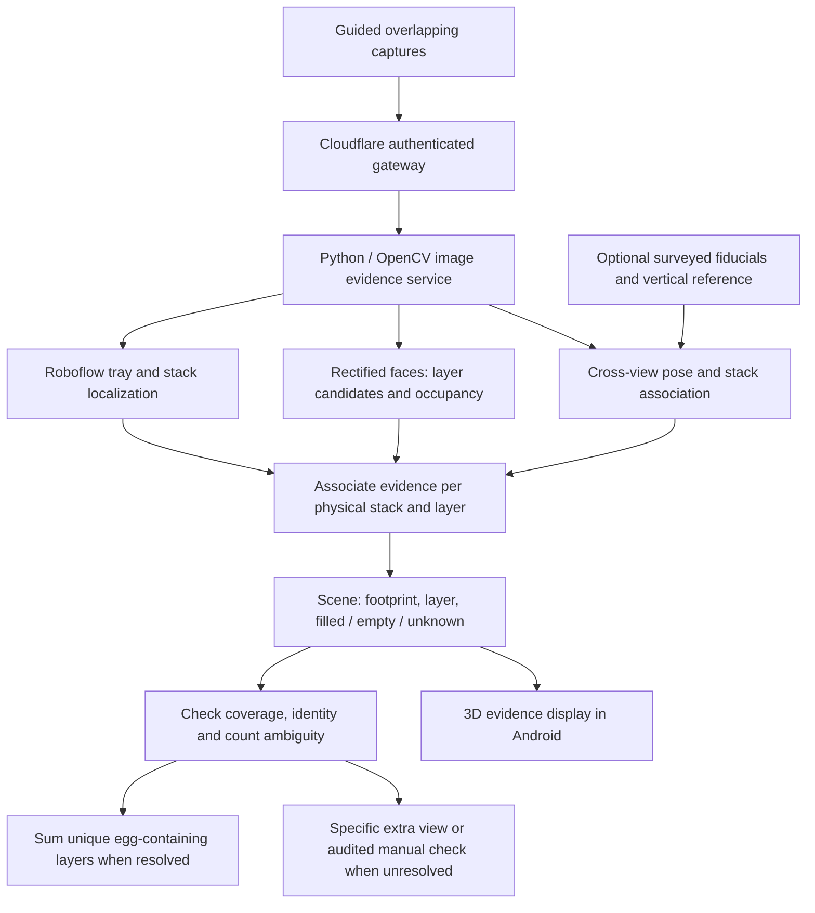
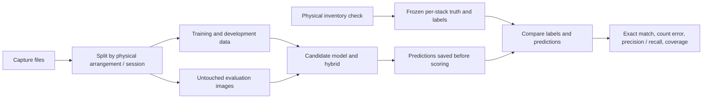

# Counting architecture and ground-truth workflow

Latest training clarification (2026-09-15): see [the phased plan](100_TRAY_SCENE_PLAN.md).
Physical tray detection, egg occupancy and cross-view deduplication must be
validated separately. The assisted19/19/20/19/19 brightness bands are supporting
research evidence, not accepted tray counts. The new individual-tray photos
have incomplete draft labels; no retraining or model promotion has occurred.

Checkpoint: 2026-09-15. This separates the recorded production baseline from
the proposed hybrid. No deployment or new APK is part of this checkpoint.

## Recorded production baseline

Requested rollback version: `621a5a9c-f486-455f-9a15-0965ca3a710f`.
The rollback and health/readiness were verified previously; upload probes hit
TLS resets. The supplied phone screenshots are user-reported runtime evidence,
not a fresh agent inference run. See the [rollback report](../reports/cloudflare-rollback-20260915/README.md).
Private Roboflow credentials stay server-side.

This baseline compares totals; it does not reconstruct unique physical trays.
The local newer Worker and standalone Python hybrid components are not this
deployment. APK 0.2.2 expects `model_spatial_v1`, absent from the restored
baseline; a compatible build and device validation remain necessary.

## Proposed hybrid pipeline — integration unfinished

Missing markers must leave the model and visual association route available.
Painted boxes identify footprints, not tray counts. Surveyed fiducials can help
recover pose; floor projection alone does not measure vertical height. Metric
height requires calibration and a usable scale reference. Repetitive trays,
nesting and occlusion still require measured uncertainty and occupancy evidence.

The scene record should retain stack identity, footprint/relative position,
layer candidates, filled/empty/unknown state and source-view observations.
Deduplicate across views before summing. Do not assume equal heights or fill
unseen space with synthetic trays. A relative map can be shown without metric
scale; label it accordingly. A 3D rendering is a view of evidence, not proof.

## Ground truth is an independent evaluation reference

For this [archived case](../reports/user-100-tray-case-20260915/README.md), the
user reports 20 filled trays in each of five columns, plus one empty on top of
column 3: **100 eligible, 1 empty, 101 physical**. This is user-reported ground
truth, not an independent physical recount. Depth layout is not established
by the supplied front image alone.

Reported model counts 84/90/87 have absolute errors 16/10/13. They cannot reveal
which trays were missed, or establish precision/recall without matched labels.
The assisted layer run returned 40/10/10/11/11 candidates and no eligible total.
Neither result justifies a correction factor or forcing the answer to 100.

## Next implementation and promotion steps

1. Obtain original three-angle captures and raw predictions; annotate misses,
   duplicate detections, tray boundaries and visible occupancy against checked
   per-stack truth. Retain unknown labels for genuinely hidden content.
2. Compare full-resolution crops and corrected training labels on development
   scenes; fix layer-spacing ambiguity and automatic stack localization.
3. Integrate per-stack identity, occupancy and optional calibrated geometry in
   a separate candidate endpoint. Keep baseline traffic unchanged during trials.
4. Evaluate varied unseen counts and layouts, including 73/99/100/101 cases;
   split entire arrangements rather than individual photos. Report exact scene
   match, MAE, false positives/negatives, precision/recall and acceptance coverage.
5. Only promote after the agreed held-out gates and actual Android tests pass.
   Perfect performance on the known 100-tray image is one regression result,
   not universal 100% accuracy. Fully hidden occupancy needs another observation
   or an independently verified inventory/loading record.

See the [phased plan and proposed validation gates](100_TRAY_SCENE_PLAN.md).
