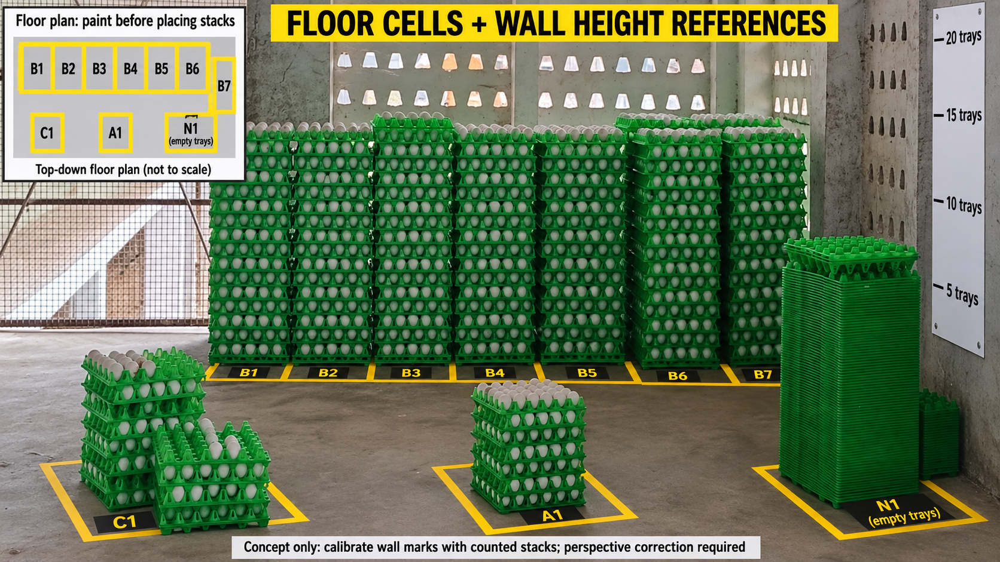

# Grid + height pilot — floor cells and wall references

This is an **offline, measurement-assisted pilot**, not automatic camera height detection and not a claim of exact warehouse counting. Count only egg-filled trays. V2 (`projec-mutta/2`) remains the deployed detector; no training, dataset uploads or model configuration changes are part of this build.

The revised illustration was created with the built-in image-generation tool from a warehouse photo. Its geometry, wall levels and example cell assignments must not be used as measurements, inventory ground truth or training data. [Generation prompt](../mobile/assets/floor-cells-wall-reference.prompt.txt).

Paint the storage rectangles on the **ground**, before placing stacks. Tightly adjacent stacks can hide their floor boundaries; do not draw boundaries vertically on trays. Put readable cell IDs on exposed ground in front. Wall-height reference levels must be set from physically counted, loaded stacks of the actual tray type and support. Do not copy the illustrated 5/10/15/20 levels. A wall behind the stack lies at a different depth: direct pixel-height comparison is invalid without perspective calibration. Example cell C1 contains multiple columns, so record C1-1 and C1-2 separately.

The APK remains a manual ruler-input pilot, not an automatic reader of floor or wall markers. Version 0.2.1 moves camera enumeration out of app startup and into photo mode after its backend preflight. This isolates the offline workflow from the CameraX startup crash observed in 0.2.0; it does not establish that the native camera plugin is fixed for photo capture.

## Use the APK

1. Open **GRID + HEIGHT PILOT**. Number each physical floor cell; use separate column IDs such as `A1-1` and `A1-2` when a cell contains several columns. Do not infer occupied positions from a cell's capacity.
2. Use one tray type, egg-filled upright stacks, and the same support. Physically count reference stacks of 1, 5, 10 and a larger count (11–200). Measure each from its support to its top **tray rim**, excluding pallet height and egg tips. Enter the actual measurements in cm; all fields deliberately start blank.
3. Enter a defensible ±cm uncertainty covering reading, repeat measurement and loading variation. Remeasure inconsistent references. Never tune the uncertainty merely to make a desired count pass.
4. Enter one cell ID and its measured stack height, confirm the setup, then **CHECK HEIGHT**. The app lists the count(s) consistent with the calibration; it does not force rounding. Ambiguous, inconsistent or out-of-range heights require recounting.
5. Physically recount the trays and enter that number even if it differs from the estimate. **SAVE PHYSICAL RECOUNT** records the truth separately from the candidate. No pilot result is automatically verified.
6. A second observation of the same normalized cell ID updates its displayed tally after confirmation; it never adds another camera view to the total. Previous observations remain in the report. **START NEW TALLY** starts an empty cell list without deleting evidence.
7. **COPY PILOT REPORT** copies JSON containing the calibration snapshot, measured height, candidate, physical count, timestamps, cell ID and tally ID. Paste it into a file to back it up before uninstalling or clearing app data. This small local log is not a production inventory database or cloud backup.

The total is the latest **operator-counted** observation for each recorded cell in the current tally. It is not a whole-warehouse total, does not prove hidden cells are empty, and does not infer an egg count from 30-position tray capacity.

## Calibration model and rejection rules

For a column with `n` trays, assume `H(n) = H1 + (n - 1) × pitch`. H1 includes the actual first-tray offset and pitch is calibrated from loaded trays, not a universal manufacturing constant. Each reference and observation is an interval ± the entered error. The solver intersects pairwise pitch bounds and tests integer counts against every reference interval. It also tests adjacent out-of-range counts, so limiting the search cannot manufacture a unique boundary result.

A unique candidate is only conditional on the calibration assumptions. Uneven loading, tray changes, compression, hidden gaps or an incorrect height reading can still invalidate it. Physical confirmation remains mandatory. There is no multiplication of maximum height by floor capacity, no automatic marker recognition, no floor-pixel-to-height conversion and no ML inference in this mode.

Automatic image measurement is deferred until actual calibrated photos are available. A floor homography applies to the floor plane, not a vertical stack; use a vertical reference beside the stack face at the same depth and controlled camera pose. [OpenCV homography reference](https://docs.opencv.org/4.x/d9/dab/tutorial_homography.html).

## Evidence and release boundary

- Flutter tests cover synthetic calibration counts, ambiguity, out-of-range rejection, malformed numeric input, JSON round-trip, blank calibration, saving a real count that differs from the estimate, duplicate-cell replacement, preserved previous tallies and write failure. **Synthetic tests are not field-accuracy evidence.**
- The existing untouched detector benchmark remains V2 **2/10 exact, MAE 22.9**. The previously tested tiled variant remains **0/10 exact, MAE 46.2 — DO NOT DEPLOY**. These are recorded prior runs, not new measurements of the height pilot.
- No height-pilot exact-match or MAE is available: the old ten benchmark photographs have no verified height calibration. Collect additional physically measured stacks not used as calibration references. Report abstentions separately and report MAE with its scored denominator; do not hide rejected cases or present repeated cell views as independent samples.
- The image is illustration only. No warehouse photos, labels, golden benchmark files or raw source pools were modified for this feature.
- The updated photo client requires `/health` to advertise `scan_contract: cell_identity_v1` before capture/upload and still validates returned cell IDs. The local Worker advertises this contract and retains V2, but **this turn does not deploy that Worker**. The live server was checked and still returns only `{"status":"ok"}`. Consequently photo mode in this APK reports a backend update requirement; it must not silently fall back to comparing unrelated views. The offline height pilot is usable independently.
- No public APK release or GitHub push is implied by a local build. See the build evidence alongside the new APK for its actual signature, version and checks.

No real measurements are prefilled, no accuracy percentage is promised, and no model was promoted through a relaxed gate.
