# AWS execution preparation

No AWS resource was created, and no credentials were retrieved. The custom
training container and job request are prepared, not Docker-built or cloud-tested.
This host has no Docker or AWS CLI on PATH. GPU runtime compatibility, IAM,
ECR digest, bucket versioning, regional quota and budget still need verification.

## Dataset and training

1. Run dataset `--check-only`, freeze faces.json and record its SHA-256.
2. Stage only manifest dependencies locally:
   `python model-improvement/stack-heatmap/aws/package_dataset.py reports/stack-heatmap-20260928/dataset/faces.json work/aws-curated/`
3. After explicit approval for account/storage/compute charges, use a versioned
   private S3 bucket and upload that unpacked folder to a new prefix named by
   manifest SHA. Keep `bundle-manifest.json`; never overwrite a released prefix.
4. Build from repository root with the supplied Dockerfile. Pin the tested base
   image by digest before a cloud run; resolve/pin the resulting dependency lock
   and publish to private ECR only after approval. The request requires an ECR
   digest, not a mutable tag. The supplied container trains the heatmap only.
   RF-DETR control has a separate gated local entrypoint; its compatible baseline
   checkpoint/SDK must be obtained and pinned before adding it to this container.
5. Copy training-config.example.json to a private working config. Set actual
   role, account, immutable image digest, versioned input/output/checkpoint S3
   prefixes, current verified git commit and a unique run ID. No keys go here.
6. Render a request without contacting AWS:
   `python model-improvement/stack-heatmap/aws/prepare_job.py work/training-config.json --output work/training-request.json`
7. Only after explicit billing approval, an authenticated operator can submit
   `aws sagemaker create-training-job --region ap-south-1 --cli-input-json file://work/training-request.json`.
   No script here submits, uploads, provisions a bucket, registers ECR, or deploys.

SageMaker File input keeps repository-relative manifest paths under
`/opt/ml/input/data/training`. Artifacts/metrics go to `/opt/ml/model`. Each epoch
saves both resumable optimizer/RNG state and best model under `/opt/ml/checkpoints`;
Spot restores that S3 checkpoint prefix after interruption. The frozen config and
manifest must match on resume. Training is currently an in-memory pilot; introduce
mini-batches before a large release. Two tiny development groups are not a final
acceptance set. Do not spend a GPU hour on the incomplete V5 control snapshot.

IAM: short-lived role/session credentials via the normal AWS chain, S3 access
limited to the curated/run/checkpoint prefixes, ECR image pull for the job role,
CloudWatch training logs and a scoped iam:PassRole for the submitting operator.
Use separate training and inference roles. Configure log retention and an owner
tag. Delete unused endpoints/compute after tests; retained S3/ECR still costs.

## Production target, pending gates

```mermaid
flowchart LR
  A[Android guided capture/upload] --> C[Cloudflare auth/session/job gateway]
  C --> J[AWS asynchronous job adapter]
  J --> V[Python vision container]
  V --> L[Localize faces and rectify]
  L --> H[Warmed heatmap + RF + deterministic rims]
  H --> S[Sequence candidates]
  S --> O[Occupancy evidence]
  O --> G[Cross-view physical X/Y/Z grid]
  G --> K[SceneCertifier]
  K --> R[Persist evidence/result]
  R --> C
```

For a small beta, persistent ECS on an EC2 GPU instance avoids model reload for
each request. Fargate is not the GPU target. An alternative is SageMaker
asynchronous inference: the gateway writes a private input object, submits a job,
and reads its result object. The same gateway scan ID/status/result envelope can
hide either transport from Android. Native SageMaker async is not a direct
replacement URL for FastAPI multipart; implement the S3/job adapter first.

Cloudflare holds auth/session/security and job status, not OpenCV/PyTorch GPU work.
Heavy processing must not rely on a synchronous mobile/Worker timeout. Keep a
bounded queue, warm one model per process, time each stage and scope uploads to
the session. Private archive retention and deletion remain explicit policies.

The implemented authenticated `/candidate/stack-heatmap` accepts one source image
plus hash-bound proposed quadrilaterals. It returns original polygons/homography,
heatmap peaks, optional hash-bound RF centres, band alternatives, unknown
endpoints/occupancy, image-quality diagnostics and unresolved physical Z. It
always returns `inventory_total=null`, `physical_grid=null`, `verified=false`.
It is a research adapter, not a trained automatic localizer or SceneCertifier.
Only the eventual SceneCertifier may emit verified=true after complete scope,
cross-view identity, layer and occupancy gates pass.

Primary implementation references:
[SageMaker checkpoints](https://docs.aws.amazon.com/sagemaker/latest/dg/model-checkpoints.html),
[Spot training](https://docs.aws.amazon.com/sagemaker/latest/dg/model-managed-spot-training.html),
[training storage paths](https://docs.aws.amazon.com/sagemaker/latest/dg/model-train-storage-env-var-summary.html),
[CreateTrainingJob](https://docs.aws.amazon.com/sagemaker/latest/APIReference/API_CreateTrainingJob.html).
