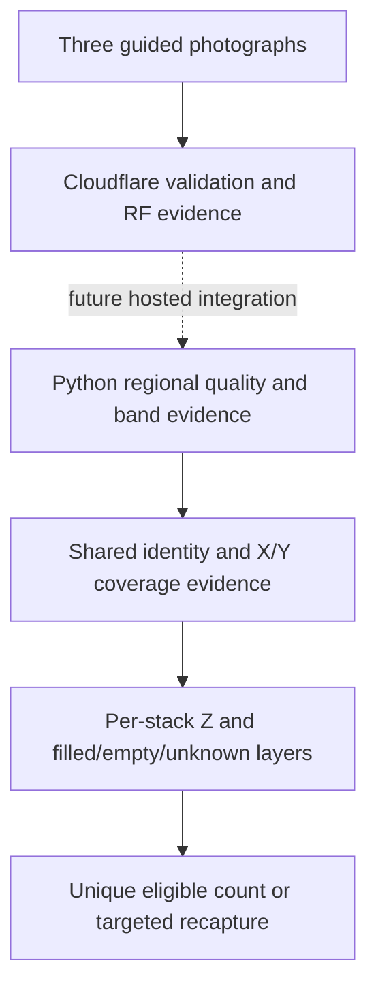

# Candidate milestone — 2026-09-17

Branch: `codex/hybrid-cell-counting`. Starting commit:
`d5ddcc8d9fa8ed06052e14503ec1ce2a3a07b9ba`. The commit containing this report is
the implementation checkpoint (`git log -1 -- reports/candidate-20260917`).

## Delivered

- Existing X/Y/Z accounting extended with physical stack IDs, source observations,
  per-layer provenance and observed views. Shared corners and shared rear stacks
  count once. Conflicts, hidden positions and unknown occupancy block totals.
- Strict local `spatial_3d_beam_v1` request/response schemas, revision
  `candidate-20260917`. Expected totals are rejected as input; declared SOP flags
  require actual booleans. Generic RF classes never certify egg occupancy.
- Top/middle/bottom exposure, dark/highlight fractions, contrast, sharpness and
  horizontal rim contrast measured inside proposed faces. Guidance identifies
  view, stack, region, cause, action and evidence source.
- Mutual SIFT matching, inlier spatial coverage and projected-face overlap added
  to RANSAC filtering. All remaining matches would still be provisional.
- Worker native Buffer encoding replaces the large binary-string intermediate;
  hashing and inference are sequential. Encoding occurs once per view and is
  reused across retries. Byte sizes and stage latencies are logged without images
  or credentials. The multipart body still occupies memory; no production fix
  is claimed. The added Node package supplies compile-time types only.

## Synthetic accounting

| Fixture | Eligible trays |
|---|---:|
| Five columns, two rows, 20 filled per stack | 200 |
| Rear X3 explicitly absent | 180 |
| Rear X3 has 15 filled layers | 195 |
| Front/right shared corner observed twice | 200 |
| Same rear stack seen left and right | 200 |
| One extra empty physical tray | 200 (201 physical) |
| One layer has unknown occupancy | null |
| Rear X3 unobserved, not declared absent | null |

`synthetic-grid.json` preserves complete records. These fixtures supply explicit
geometry and occupancy; they do not demonstrate automatic image reconstruction.
Tests also check 10/20/40 band ambiguity, targeted bottom-dark guidance, crop
warnings, declaration provenance, malformed metadata and production-route blocking.

## Archived photo replay

All 35 source hashes matched the frozen MUTAA manifest. Regional diagnostics
were calculated for 106 previously proposed faces, preserving the existing RF
and band evidence. **Zero new model calls, zero retraining, no physical truth.**
The proposals do not necessarily contain complete physical stacks.

Pilot thresholds produced one `BOTTOM_DARK` recommendation (image05 candidate1),
one possible top crop and eight possible base crops. Unflagged regions are not
certified: thresholds are uncalibrated and some images have no proposed face.
Occlusion remains unknown unless declared by the operator. A weak-sharpness
warning cannot distinguish motion from defocus or featureless texture.

The previous tentative group 07/10/11 was replayed for correspondence only:
zero supported proposals and zero accepted identities. Its same-scene identity
and view assignments remain unconfirmed. Per-image recommendations outside that
group use a placeholder STRAIGHT label; they must be relabeled before operator use.
No real X/Y grid, eligible total, precision or exact-count accuracy is reported.

Image07 retains historical RF56 and band hypotheses near 16/20/22/19/19;
image10 retains RF12 and one partial face. Empty-tray and shell failures from the
previous audit remain unresolved. Their generic class is not filled-tray proof.

## Architecture and next action

Python remains local; there is no fake Worker-to-Python integration. The current
candidate deliberately cannot return `verified: true`. SOP declarations guide
rejection but do not prove hidden stock. Physical inventory is established by
independent inspection, not generated by the algorithm.

Next: confirm one unchanged LEFT/STRAIGHT/RIGHT triplet, record each X/Y stack's
physical/filled/empty truth and hidden gaps, then freeze it outside inference.
Annotate full faces, tray endpoints, shared corners and occupancy; evaluate
regional thresholds and same/different identity pairs. Run a recorded crop-based
RF comparison before deciding whether revised labels/training are needed.
Only connect image evidence to inventory when correspondence and occupancy have
validated acceptance rules. Then host/integrate Python, validate payload limits,
and update Android. WebSockets and warm inference are later latency choices;
neither resolves missing visual evidence.

APK remains 0.2.2+5. No deployment, APK rebuild, hosted service or model change.
Latest recorded Worker remains ab67cd59-3f4e-4628-a0fa-d085f56a3fe8; not redeployed
or rechecked against production during this local milestone.

Reproduce with `PYTHONPATH=work/vision-deps;backend` on Windows:
`python scripts/evaluate_candidate_milestone.py`.
Frozen source: `reports/mutaa-20260916`; output is separate.

## Verification

65 backend tests passed; all 13 spatial candidate tests passed again after final
SOP/production-guard changes. 13 Worker tests, TypeScript compilation, targeted
Ruff and Wrangler deployment dry run passed. Existing AnyIO and Node module-type
warnings remain. No deployment was executed. npm reported three high dependency
advisories; broad dependency upgrades are outside this milestone.

Local Node benchmark on 12,597,763 bytes: three byte-identical runs, median
2295 ms for the previous encoder versus 10.93 ms native. See
`encoding-benchmark.json`. No Worker memory/load conclusion follows from this.
