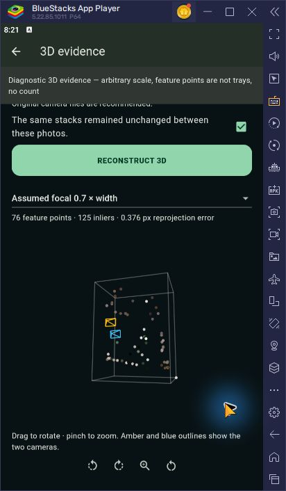

# Reconstruction integration checkpoint - 7 October 2026

The staging upload-to-AWS-to-APK path works for the overlapping wide pair.
This is sparse geometry evidence, not a reconstructed tray surface or inventory
count. Remaining emulator cases and the complete UI review are unfinished.

## What the screenshot means

The implementation detects SIFT keypoints, matches them between two images,
filters matches with RANSAC, estimates camera pose under focal assumptions,
and triangulates surviving points. Colored dots are sampled image features;
amber/blue outlines represent cameras; the box encloses the point cloud.
Neither the box nor the points represent individual trays.

The user-supplied screenshot shows 100 points, 125 inliers and 0.447 px median
reprojection error, consistent with the saved wide-pair focal factor 1.4 output.
That error measures agreement of selected correspondences with the assumed
camera geometry. It does not establish correct correspondences, metric depth,
tray boundaries, occupancy, or counting accuracy. Calibration is null and
stable_scene_confirmed remains false in the backend output. The app checkbox
was exercised as a demonstration assumption, not a physical-scene verification.

Missing stages: dense depth estimation/fusion, surface meshing/texturing,
tray/stack segmentation and cross-view instance association. The current route
does not invoke the Roboflow detector. Repetitive tray patterns can create
ambiguous feature matches; the current evidence does not isolate their exact
contribution to error. Two views also leave unobserved surfaces unresolved.

[COLMAP's tutorial](https://colmap.github.io/tutorial) distinguishes sparse SfM
from dense multi-view stereo and meshing. Adding those stages could produce a
recognizable visible surface, but cannot by itself certify a tray count or hidden
egg occupancy. A rendered synthetic stack would be an assumed illustration,
not independent measurement.

## Deployment and checks

- AWS Lambda: egg-tray-vision-pilot, ap-south-1, Active/Successful,
  2048 MB, 120 s, no provisioned concurrency.
- Image: pilot-20261007-integration;
  `sha256:8511bd3af2afb02a8d7c8107bc83f2032c14299eefbd504cf6105e0d30218dba`.
- Temporary EC2 builder `i-010cbb8cea282372d` terminated; temporary role,
  profile and security group removed by deployment cleanup. Retained services
  can incur metered charges; no zero-cost claim.
- Staging: https://egg-tray-counter-api-staging.rahultech72216.workers.dev.
  Version after secret attachment: `bae12d3c-5069-4c88-97e2-8b2e5e89f452`.
- [Health evidence](health.json): staging advertises reconstruct_v1;
  production health unchanged. Anonymous direct reconstruction returned 401
  during deployment verification. Bearer token stays server-side.
- Backend: 82 tests passed; one anyio deprecation warning.
- Worker: 20 tests passed, TypeScript compilation and staging dry-run passed.
- Flutter: 66 tests passed. Final analyzer: no issues, 170.2 seconds.
- APK: 0.3.4+10, built and installed in BlueStacks; signature verified using
  the existing Android debug certificate ([signature](apk-signature.txt)).
  SHA256 `B42252BF5910EDC9A5E017A8EE08B4A23652CA62104564AA3724E87156ED150B`.
  Build artifact: ../../mobile/build/app/outputs/flutter-apk/app-release.apk.
- No production Worker deployment, Roboflow change, retraining, commit or push.

## API pair results

Point totals correspond to assumed focal-width factors 0.7 / 1.0 / 1.4.
All four responses retain physical_trays=null and verified=false.

| Pair | Photo IDs | Status | Matches | Inliers | Points | Worker wall time | Direct AWS equal |
| --- | --- | --- | ---: | ---: | --- | ---: | --- |
| [Wide positive](wide-positive/worker.json) | 1 + 2 | reconstructed | 175 | 125 | 76 / 94 / 100 | 11.627 s | yes |
| [Negative control](negative-control/worker.json) | 1 + 4 | insufficient_matches | 2 | 0 | none | 9.646 s | yes |
| [Wide + side](wide-side/worker.json) | 1 + 3 | reconstructed | 9 | 9 | 8 / 9 / 9 | 9.927 s | yes |
| [Side + close](side-close/worker.json) | 3 + 4 | reconstructed | 180 | 129 | 76 / 120 / 87 | 9.608 s | yes |

Nine matches in wide-side are weak support: status means the numerical pipeline
returned a hypothesis, not that geometry has been validated. API replays are
separate from manual APK requests. Saved Worker JSON must not be described as
an intercepted APK response. Direct AWS JSON is in each pair's lambda.json.
Full paths, hashes, request IDs and timings are in [pairs.json](pairs.json).

Originals: ../warehouse-20260923/input/image-1.jpg through image-4.jpg.
The negative-control copies have the same hashes as 1 and 4.

| Photo | SHA256 |
| --- | --- |
| 1 | bd2ba34e77d6cda94ed982d678590d9a5a0bde5a9b684dbaec0591ffa6ca0970 |
| 2 | c0787e5dfab960ca142539c052860a0f8b8e8814b6eb95cc9b6daa03f2c1e1c8 |
| 3 | a63e3532c9850d20b4c2b18b3ed3404ff55f83536cfa99175c688f136999497c |
| 4 | fb5bd22bfe8d1b3da1714ad9f1ef9f90330d562d6bd499bb6005446886506e66 |

## Emulator evidence and pending checks

Installed APK renders in BlueStacks OpenGL. Through visible UI: changed Settings
to staging, opened the 3D flow, picked original files 01-wide.jpg and 02-wide.jpg,
observed metadata warning, checked the demonstration same-scene assertion,
submitted and saw 76 points / 125 inliers / 0.376 px at focal factor 0.7.
The diagnostic banner remained visible above the scrolled result.

Automated rotation attempts were interrupted by local input. The user's later
screenshot shows another hypothesis, but is not claimed as an agent-verified
rotation test. Still pending: two saved rotations per successful pair, the three
remaining pair submissions through the APK, complete selector/zoom/reset checks,
camera gates on a real phone, and the requested post-build UI review. No complete
manual test pass or exact reconstruction claim is made.

## Next focused steps

1. Finish the pending manual UI matrix without changing production.
2. For counting, inspect per-tray/stack detections overlaid on the original
   photos; audit missed layers and duplicate front/side associations against
   the retained manual visible references. Do not convert point totals to trays.
3. For recognizable 3D geometry, evaluate a dense reconstruction pipeline
   locally on an unchanged, overlapping capture sequence with measured camera
   calibration/scale. Use real evidence to decide whether heavier hosting is needed.
4. Measure exact per-stack count and scene-total error on independently
   physically counted scenes before promoting any inventory result.
