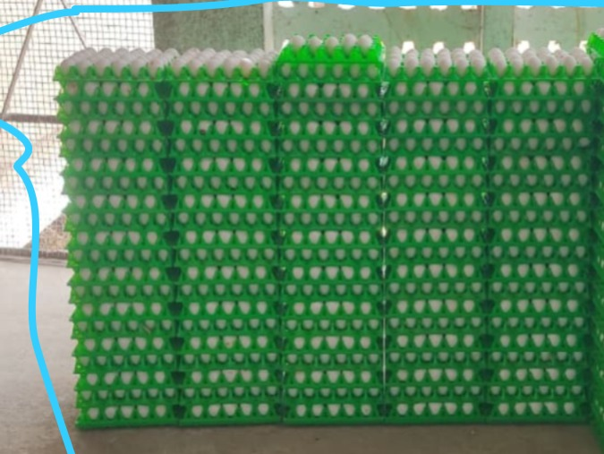
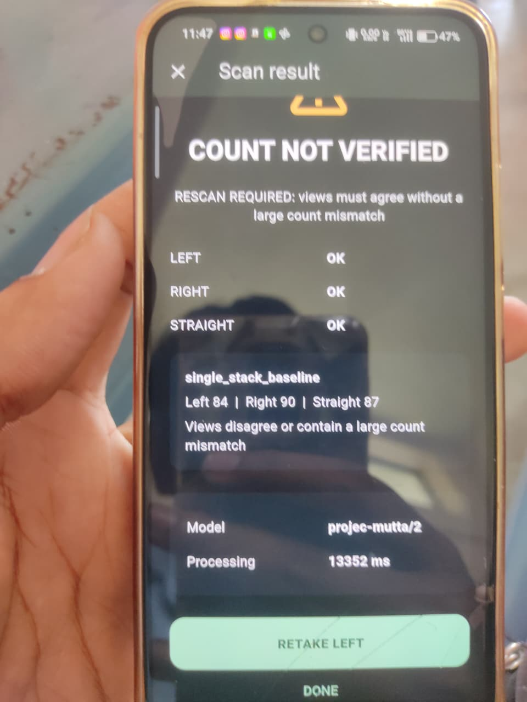
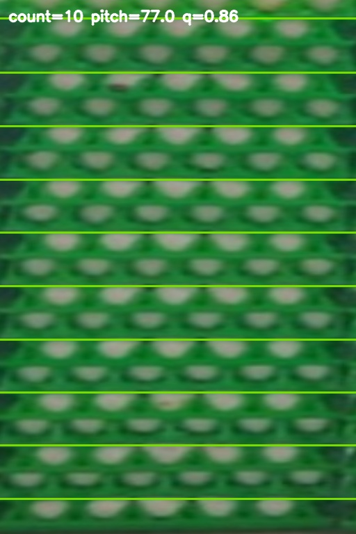

# User-reported five-column case

reference.json preserves source hashes and user-confirmed counts: five columns
of 20 egg-containing trays and one additional empty tray atop the middle column.
The two screen photographs represent the same reported 84/90/87 scan, not two
independent evaluations. No raw detector boxes or original capture triplet are
available in the supplied folder.

Assisted layer experiment: scripts/evaluate_100_tray_layers.py manually rectifies
five faces on scene-annotated.jpg, runs the unchanged layer counter, and only
then reads truth for scoring. Results: 40/10/10/11/11 physical-layer candidates.
This is not automatic localization, not occupancy classification, and not fresh
Roboflow inference. The visible column-2 overlay skips alternating tray rows.
The high internal quality does not certify a count. No correction factor applied.

Reproduce from repository root with the existing backend dependencies on
PYTHONPATH: python scripts/evaluate_100_tray_layers.py. Windows test host WMI may
need Python's OS fallback (see PROGRESS.md); do not change application inference.

Next evidence required: original LEFT/RIGHT/STRAIGHT images or fresh same-scene
captures, plus their raw detections. Do not use the known total as model input.

## Supplied images

User-reported inventory: 100 egg-containing trays and one empty atop column 3.
The blue boundary is already present in the supplied image.

[Second photograph of the same result](result-2.jpg) is preserved separately,
not counted as an independent scan.

## Assisted diagnostic overlays

These are existing layer-counter outputs on manually selected faces, not
verified tray annotations. Column 2 illustrates skipped alternating rows.

| Column from left | Reported physical truth | Layer candidates | Overlay |
| --- | ---: | ---: | --- |
| 1 | 20 | 40 | [Column 1](layers-column-1.jpg) |
| 2 | 20 | 10 | [Column 2](layers-column-2.jpg) |
| 3 | 21, including 1 empty | 10 | [Column 3](layers-column-3.jpg) |
| 4 | 20 | 11 | [Column 4](layers-column-4.jpg) |
| 5 | 20 | 11 | [Column 5](layers-column-5.jpg) |

See [architecture](../../docs/COUNTING_ARCHITECTURE.md) and
[implementation plan](../../docs/100_TRAY_SCENE_PLAN.md). Frozen machine-readable
records: [reference](reference.json), [layer evaluation](assisted-layer-evaluation.json).

## Later research checkpoint

[2026-09-15 measurement research](RESEARCH_20260915.md) records the multi-pitch
band candidate, 19/19/20/19/19 assisted outputs, plots, instance-scoring tooling
and remaining limitations. These are not verified physical or eligible counts.
