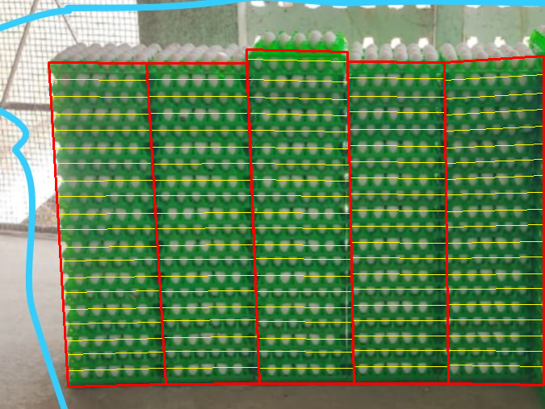
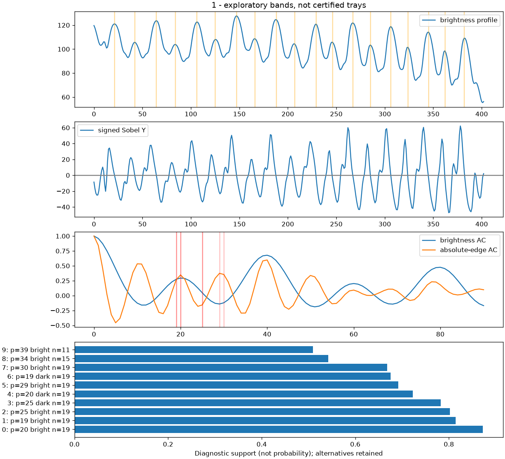
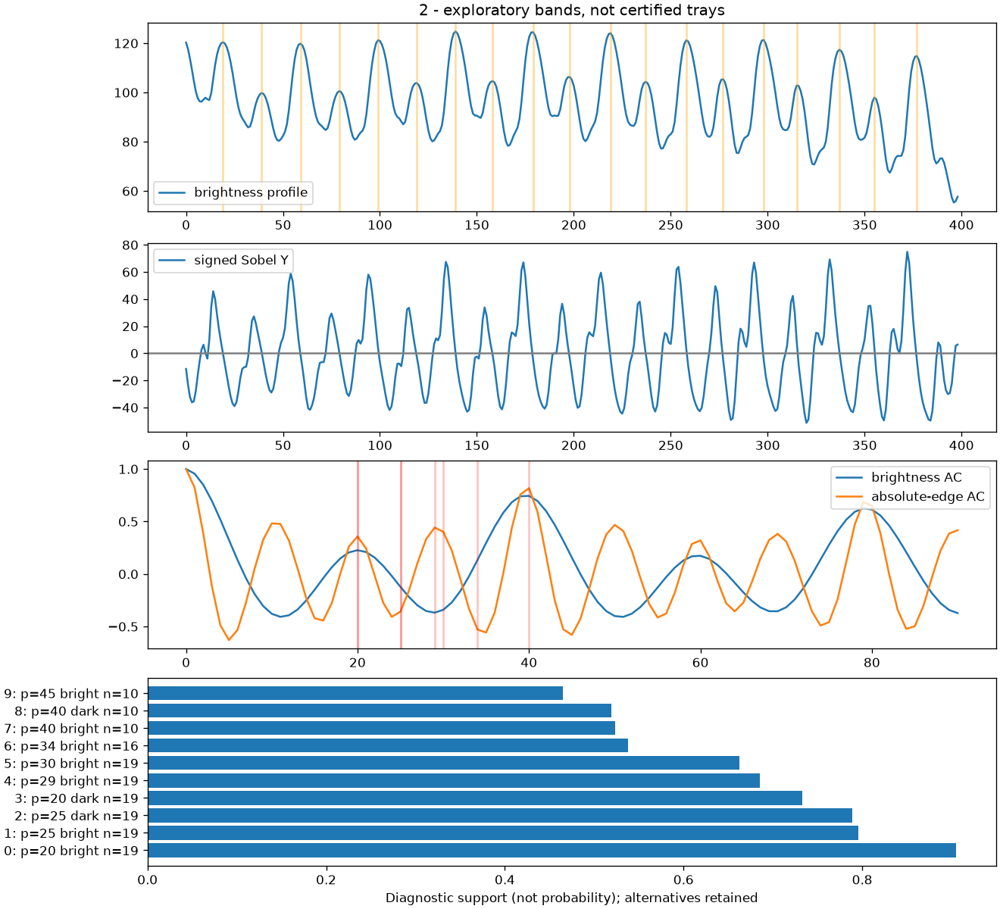

# Per-stack measurement research — 2026-09-15

Status: local candidate, incomplete. **Exact physical 101 / eligible 100 was not
achieved.** No Cloudflare deployment, APK rebuild, RF training or model promotion.
Production remains intentionally outside this research run.

## Results and their meaning

| Column | User-reported physical truth | Legacy layer candidates | New exploratory bands | Signed band-count error |
| --- | ---: | ---: | ---: | ---: |
| 1 | 20 | 40 | 19 | -1 |
| 2 | 20 | 10 | 19 | -1 |
| 3 | 21, including one empty | 10 | 20 | -1 |
| 4 | 20 | 11 | 19 | -1 |
| 5 | 20 | 11 | 19 | -1 |

The new band sum is 96, compared with 101 physical trays. Per-column band MAE is
1.0 versus legacy 11.8. These are **assisted band-count diagnostics**, not physical
instance accuracy or eligible inventory accuracy. The overlay follows bright
row/egg structure; a band is not yet a validated physical rim. Do not describe
96 as a verified physical total, or compare it with 100 as occupancy accuracy.
Physical count, filled count, empty count and eligible total remain null.

The user-confirmed truth remains 100 filled plus one empty atop column 3. The
algorithm did not receive those counts or an empty-tray location. It received
only image pixels and the previously recorded manual face geometry. The old
32-visible-tray benchmark and all previous reports remain unchanged.

## Root cause established from code and signal measurements

1. Legacy `horizontal_structure_signal` takes absolute Sobel-Y **before** averaging.
   Opposite-polarity transitions become indistinguishable. Multiple edges in one
   appearance cycle can therefore create a shorter repeating period.
2. `estimate_pitch` selects the first autocorrelation maximum above 72% of the
   strongest local maximum (and the minimum strength gate). It does not compare
   alternative physical interpretations. Column 1 selects pitch 20 at rectified
   height 768 (AC about 0.459), approximately half the row period. Columns 2–5
   select 77/74/76/75 pixels (AC 0.842/0.837/0.768/0.789), approximately twice it.
3. That single decision controls `find_peaks` minimum spacing (`0.58*p`). With
   the doubled pitch, alternate bands are suppressed. With half pitch, separate
   edge structures can be counted independently. Missing-rail inference cannot
   repair a wrongly chosen fundamental and may reinforce it.
4. Alternating strong/weak brightness rows produce stronger two-row correlations
   than single-row correlations. The attached plots show this directly. Internal
   periodicity/quality can remain high while the physical interpretation is wrong.
5. Manual face endpoints and the compressed 675x507 input add a separate problem:
   `find_peaks` does not identify an extremum at an array endpoint, and a cropped
   band may lack one of its edges. Exact top/bottom completeness is not established.
   The new result is one band below each reported physical count, but **adding one
   is not justified** without inspecting the physical rim and crop-edge evidence.

Half/double pitch is demonstrated as a signal failure. Precisely assigning every
old false edge or missed tray to a physical instance still requires reviewed
geometry/labels; this report does not invent that missing correspondence.

## Candidate method and hypotheses

`backend/app/vision/stack_measurement.py` adds a separate research path. Legacy
`count_layers` and the serving API stay unchanged pending validation; the guard
against treating individual `egg_tray` boxes as whole-stack faces remains intact.

The candidate keeps signed Sobel polarity and brightness extrema. It pairs a
rise/fall or fall/rise around each band and uses a single consistent polarity per
hypothesis, never adding both polarities together as trays. Autocorrelation and
local spacing propose periods; each also proposes p/2 and 2p within valid bounds.
Each hypothesis retains band centres, edge intervals, coverage, explained-band
fraction, spacing regularity, pairing fraction and autocorrelation support.
Optional transformed RF centres add an alignment diagnostic.

The ranking support is the product of coverage, explained-band fraction,
regularity and paired-edge fraction. This is an experimental heuristic, not a
calibrated probability or weighted average of RF/rim/height counts. Alternatives
remain saved, including ones with the same count but a different pitch/polarity.
No inferred missing bands are silently inserted. No hypothesis is certified as
an inventory total, because physical rim semantics/completeness are unverified.

Native crops are 122x403, 124x399, 126x415, 121x400 and 124x408 pixels. They retain
source-scale detail; resizing the old crop to 512x768 did not create new detail.
Do not directly compare native-pixel pitch with the old 768-pixel-height pitch.

| Column | Selected native pitch | Selected feature/count | Half-pitch example/support | Double-pitch example/support |
| --- | ---: | --- | --- | --- |
| 1 | 20 | bright / 19 | 10 / 0.010 | 40 / 0.502 |
| 2 | 20 | bright / 19 | 10 / 0.013 | 40 / 0.523 |
| 3 | 20 | bright / 20 | 10 / 0.015 | 40 / 0.524 |
| 4 | 21 | bright / 19 | 10 / 0.008 | 42 / 0.502 |
| 5 | 22 | bright / 19 | 11 / 0.091 | 44 / 0.485 |

Selected support is 0.872/0.905/0.911/0.937/0.912. Half-pitch candidates lack a
band at each expected interval; double-pitch candidates discard about half the
observed bands. These examples use the best available polarity near each period;
see the full JSON for all alternatives. “Selected” means exploratory best, not
accepted physical measurement. Rejected-for-best alternatives are not deleted.

## Images, traces and immutable scoring







| Column | Native crop | Band overlay | Signal/hypotheses |
| --- | --- | --- | --- |
| 1 | [Crop](research-20260915-r3/column-1-crop.png) | [Bands](research-20260915-r3/column-1-bands.png) | [Plot](research-20260915-r3/column-1-signal.png) |
| 2 | [Crop](research-20260915-r3/column-2-crop.png) | [Bands](research-20260915-r3/column-2-bands.png) | [Plot](research-20260915-r3/column-2-signal.png) |
| 3 | [Crop](research-20260915-r3/column-3-crop.png) | [Bands](research-20260915-r3/column-3-bands.png) | [Plot](research-20260915-r3/column-3-signal.png) |
| 4 | [Crop](research-20260915-r3/column-4-crop.png) | [Bands](research-20260915-r3/column-4-bands.png) | [Plot](research-20260915-r3/column-4-signal.png) |
| 5 | [Crop](research-20260915-r3/column-5-crop.png) | [Bands](research-20260915-r3/column-5-bands.png) | [Plot](research-20260915-r3/column-5-signal.png) |

[Measurements](research-20260915-r3/measurements.json) were saved before
[evaluation](research-20260915-r3/evaluation.json), which records their canonical-JSON SHA-256 (sorted keys, compact separators,
UTF-8), so Git line-ending conversion cannot invalidate the content hash.
[Geometry-only inputs](assisted-faces.json) contain no reference counts or labels.
The inference CLI rejects passing an annotation/reference file as its face input.

## Instance truth and scoring

[Pending instance annotations](instance-annotations.pending.json) expand the
user's physical inventory into 101 evaluation records. They contain stack_id,
tray_index (bottom-up), bbox/polygon, physical_state and visibility. Geometry and
visibility are null pending review; null does not mean occluded. The reported
filled/empty state is user truth, not visual classification. `annotation_complete`
is false. No bounding boxes or visible-instance ground truth were invented.

`scripts/score_tray_instances.py` validates records and supports TP, FP, FN,
precision, recall, F1, signed per-stack physical/filled/empty errors and matched
occupancy confusion. It uses thresholded **one-to-one bbox IoU** assignment, not
count ratios or polygon IoU. Matching maximizes valid match count before IoU;
duplicate detections cannot both match one tray. Stack IDs need reviewed
correspondence; tray indices are identities, not a substitute for geometry.
Occluded truth is excluded from visible-instance recall and reported separately.
Incomplete geometry yields null detection metrics, never invented precision.
Unknown occupancy makes filled/empty count errors unavailable.

No RF instance error report is possible for the 84/90/87 scan: raw predictions
and original LEFT/RIGHT/STRAIGHT photos remain missing. No fresh RF call was made
on this annotated image. Screen photographs are not source captures.

## Localization, geometry and calibration status

Detection-based localization now clusters compatible tray centres/X extents and
widths, estimates sloped complete-group face boundaries, and reports centreline,
RF support and clipping. The number of stacks is not fixed. A synthetic unequal
three-stack arrangement tests this route; real five-stack automatic localization
is **not demonstrated** because the current scene has no detection boxes.
Top/bottom visibility stays unknown rather than inferred from detection envelopes.
Detection support is not calibrated stack-localization confidence.

An exploratory image-only green-region/vertical-variance probe also failed: at
Gaussian scale 6 it proposed seams x=94,316,399,547 inside a foreground region
x=60..674, rather than the visible stack boundaries. Scale 3 proposed six internal
seams. It included background and confused repeated egg structure with seams.
This is recorded as a failed heuristic, not used to claim five detected stacks.

Native quadrilateral rectification preserves source detail and records side-height
and width-ratio checks; those ratios are diagnostics, not a calibrated validation
threshold. No camera intrinsics, surveyed reference, metric height or real tray
profile was supplied. `calibrated_height_evidence` reuses the existing interval
height model, with profile identity/version and camera/survey provenance checks.
Measured 1/5/10/taller reference stacks are required; no invented tray height or
distant-wall pixel ruler. Nonlinear nesting profiles still need measurements and
an appropriate validated model if the linear interval fit fails.

RF count is unavailable on this case, rim physical count unresolved, calibrated
height count unavailable, occupancy unknown. These channels are not statistically
independent merely because they have different names. No arbitrary fusion is
applied. Future X/Y/Z identities can attach to stack records; depth rows remain
unknown and no hidden cells are populated or multiplied into a scene total.

## Reproduce and validation

Install the existing backend requirements and matplotlib for this offline plot
runner. The plot dependency was installed only in ignored work/plot-deps; it is
not an APK or production dependency. This run used NumPy 2.2.6, OpenCV 4.12.0,
SciPy 1.16.1, matplotlib 3.11.2. Use the backend on PYTHONPATH.

```powershell
python scripts/measure_stack_candidates.py --image reports/user-100-tray-case-20260915/scene-annotated.jpg --faces reports/user-100-tray-case-20260915/assisted-faces.json --output reports/new-candidate-run
python scripts/score_tray_instances.py reviewed-annotations.json predictions.json
```

The output folder must be new; existing measurements are not overwritten.
For automatic proposals, replace `--faces` with `--detections`: a JSON object with
matching image_sha256 and detections (each bbox in original xyxy pixels and
confidence in [0,1]). Keep raw RF JSON separately and record its model/settings;
this interface consumes detections, not ground truth or a supplied stack total.

All 52 backend tests passed during development. Added checks cover paired edges,
alternating strength, explicit half/fundamental/double hypotheses, blank-image
abstention, variable stack count, invalid geometry, native resolution, versioned
calibration, compensating FP/FN, occupancy error and missing annotations. Targeted
Ruff passed. JSON serialization then exposed a NumPy integer endpoint; fixed at
its source and added a serialization assertion, with final checks recorded below.

Host workarounds: Python's WMI query failed; test harness forced its normal OS
fallback by raising OSError from platform._wmi_query. OpenCV uses one thread in
the CLI after a host threading exception. No inference logic was patched for WMI.
The first plot run failed because matplotlib was absent; the second saved images
but failed JSON serialization. Both failure records and second-run images are
retained in research-20260915-r1/r2; r3 is the completed diagnostic run.

## Exact next step

Obtain a high-resolution full-stack capture (including top and bottom rims) and
its raw RF boxes, plus the original/fresh triplet when available. Review tray
rim/interval geometry and empty/filled visibility in the pending annotation
file. Then test automatic face proposals and rim-vs-egg feature selection against
those labels; handle endpoint evidence without +1 corrections. Add measured
calibration only when actual profile/pose data exists. After this known-scene
regression works, freeze physically different 73/87/99/100/101 arrangements for
held-out validation. Do not rebuild the APK or replace the baseline yet.


## Final verification and resolution control

Final backend run after the serialization/validation fixes: **52 passed**, with
one existing AnyIO deprecation warning. Targeted Ruff passed. The real CLI run
completed and its JSON parsed successfully; source overlay and columns 1/2
signal plots were visually inspected. Frozen source image hashes match.

[Resolution control](research-20260915-r3/resolution-ablation.json) runs both
algorithms on both native and 512x768 crops without truth input. Legacy native
counts are 40/10/10/10/12; legacy upsampled counts are 40/10/10/11/11. The new
band counts are 19/19/20/19/19 at **both** resolutions. Thus resizing alone does
not explain the improvement. This still does not establish physical rim or
occupancy accuracy. No held-out data or automatic real-scene localization was
validated. Current research artifact is r3; APK remains the earlier 0.2.2+5.
